基于SpringBoot的人事管理系统（程序+论文）
=
- 完整代码获取地址：从戎源码网 ([https://armycodes.com/](https://armycodes.com/))
- 作者微信：19941326836  QQ：952045282 
- 承接计算机毕业设计、Java毕业设计、Python毕业设计、深度学习、机器学习
- 选题+开题报告+任务书+程序定制+安装调试+论文+答辩ppt 一条龙服务
- 所有选题地址https://github.com/nature924/allProject

一、项目介绍
---
基于Spring Boot框架实现的人事管理系统，系统包含两种角色：管理员、用户,系统分为前台和后台两大模块，主要功能如下。

### 前台：
- 首页：展示公司的概览信息。
- 公司介绍：详细介绍公司的背景、文化、业务范围等信息。
- 联系我们：提供公司的联系方式。
- 公告：展示公司发布的公告信息。
- 招聘：展示公司的招聘信息，包括职位描述、薪资待遇等。
- 个人中心：员工可以登录后进入个人中心，管理个人信息、修改密码等。

### 后台：
### 管理员角色：
- 个人中心：管理员可以管理个人信息，修改密码等。
- 管理员管理：管理员可以管理系统的管理员账号信息，包括添加、编辑、删除等操作。
- 基础数据管理：管理员可以管理系统的基础数据，包括部门信息、岗位信息等。
- 公告管理：管理员可以管理公告信息，包括发布、编辑、删除等操作。
- 绩效管理：管理员可以设置绩效考核标准，查看员工的绩效评定结果等。
- 培训管理：管理员可以管理培训计划，包括发布培训计划、查看参与情况等。
- 人事调动管理：管理员可以进行员工的调岗、晋升、降职等管理操作。
- 薪资管理：管理员可以管理员工的薪资信息，包括调整薪资、查看薪资历史等操作。
- 单页数据管理：管理员可以管理一些单页的数据，例如公司介绍、联系方式等。
- 用户管理：管理员可以管理系统的用户账号信息，包括添加、编辑、删除等操作。
- 员工管理：管理员可以管理员工的基本信息，包括添加、编辑、删除等操作。
- 员工考勤管理：管理员可以管理员工的考勤信息，包括请假、加班、出差等操作。
- 员工请假管理：管理员可以管理员工的请假申请，包括审批、查看请假记录等操作。
- 招聘管理：管理员可以管理招聘信息，包括发布、编辑、删除等操作。
- 轮播图管理：管理员可以管理首页轮播图，包括添加、编辑、删除等操作。

### 员工角色：
- 个人中心：员工可以管理个人信息，修改密码等。
- 公告管理：员工可以查看公司发布的公告信息。
- 绩效管理：员工可以查看自己的绩效考核标准、填写绩效自评等。
- 培训管理：员工可以查看参加的培训计划、培训材料等。
- 人事调动管理：员工可以申请调岗、晋升、降职等。
- 薪资管理：员工可以查看自己的薪资信息、申请薪资调整等。
- 员工考勤管理：员工可以查看自己的考勤记录、申请请假、加班等。
- 员工请假管理：员工可以查看自己的请假记录、申请请假等。
- 招聘管理：员工可以查看公司的招聘信息。

二、项目技术
---
- 编程语言：Java
- 数据库：MySQL
- 项目管理工具：Maven
- 前端技术：VUE、HTML、Jquery、Bootstrap
- 后端技术：Spring、SpringMVC、MyBatis

三、运行环境
---
- 操作系统：Windows、macOS都可以
- JDK版本：JDK1.8以上都可以
- 开发工具：IDEA、Ecplise、Myecplise都可以
- 数据库: MySQL5.7以上都可以
- Tomcat：任意版本都可以
- Maven：任意版本都可以

四、运行截图
---
### 论文截图：
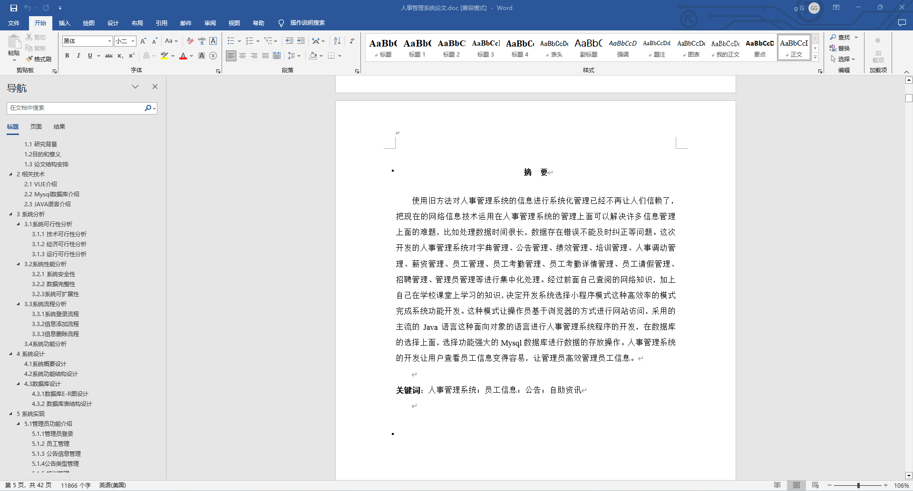
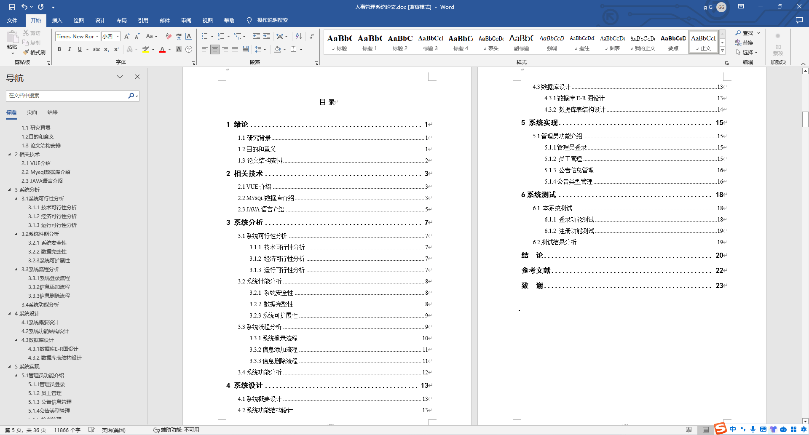

### 程序截图：
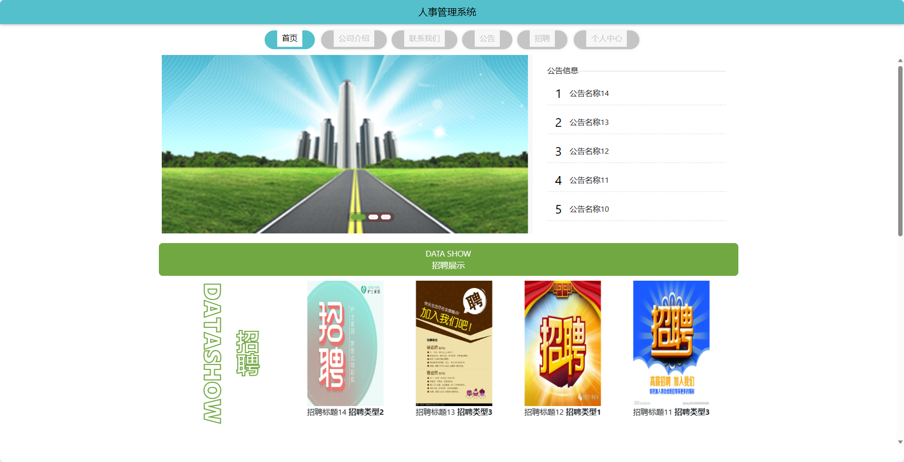
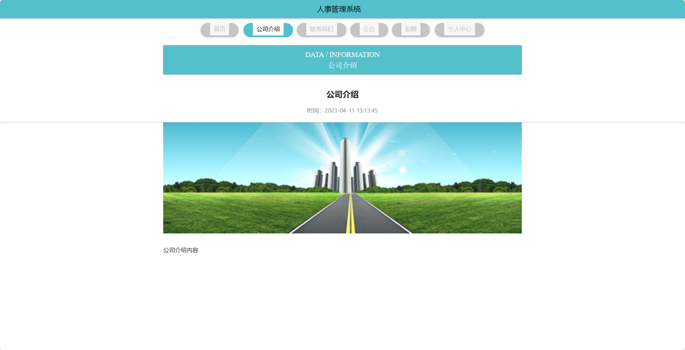
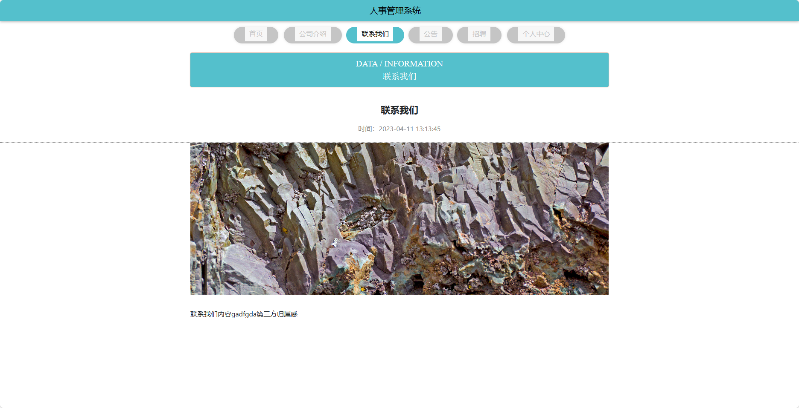
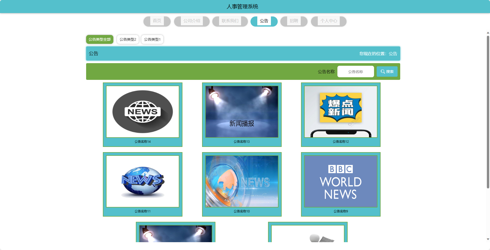
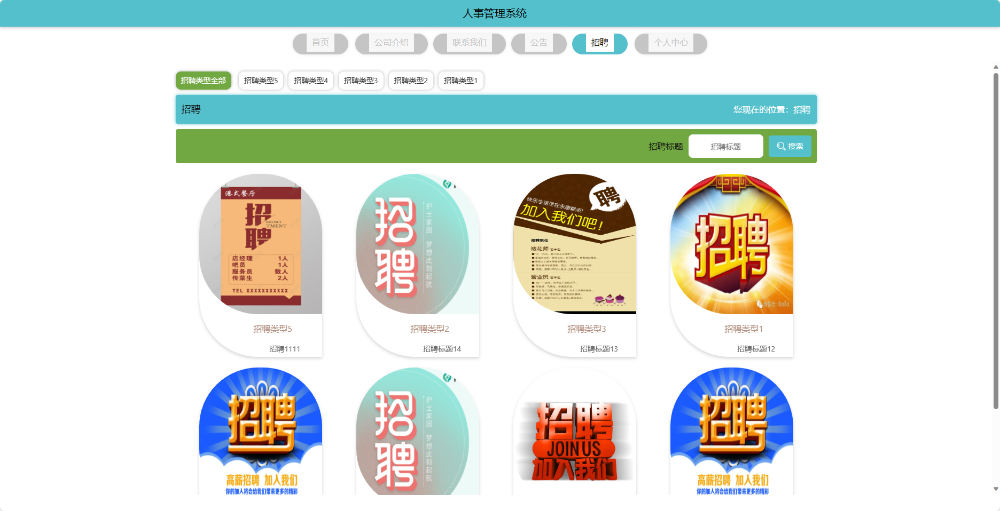
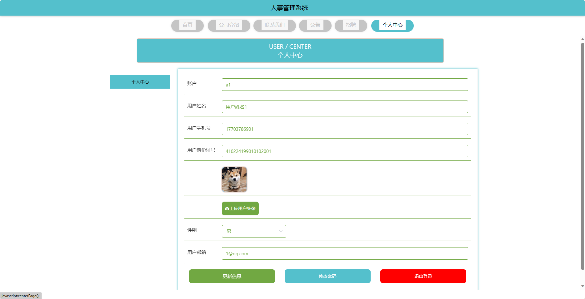
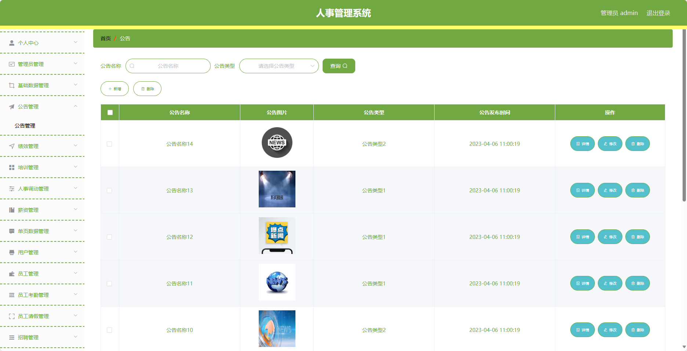
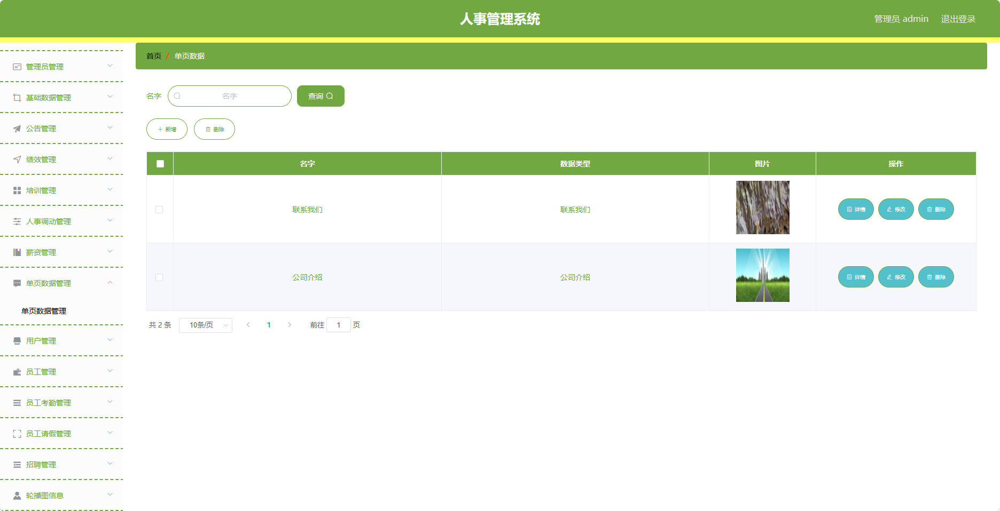
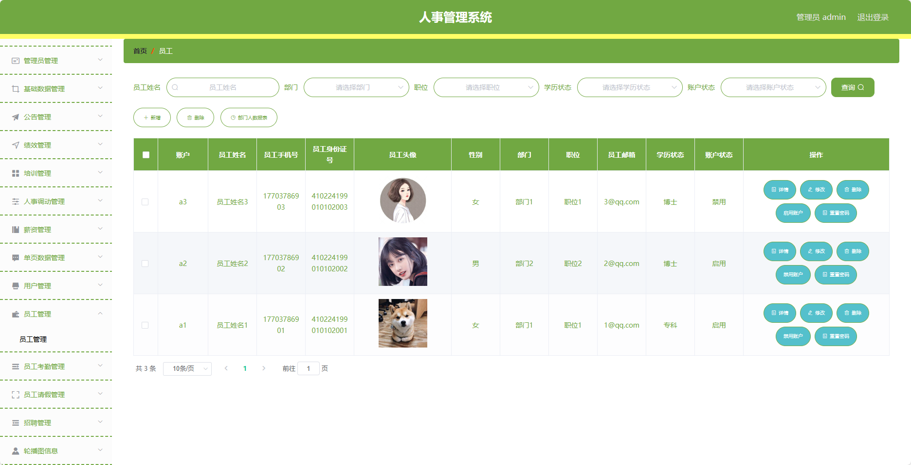
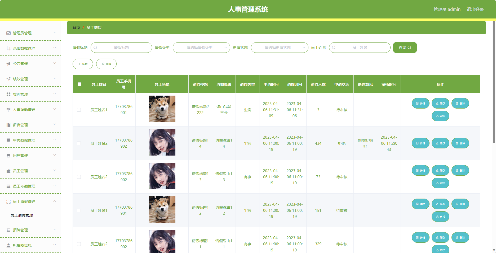

